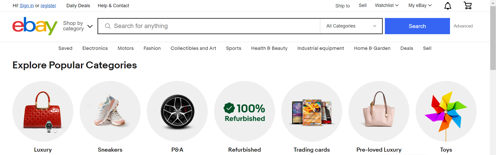
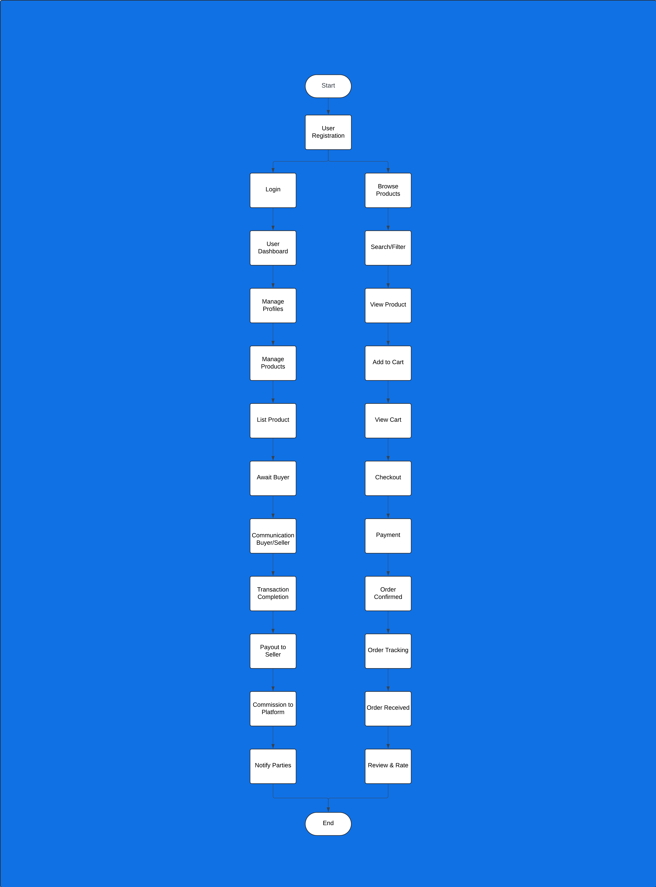
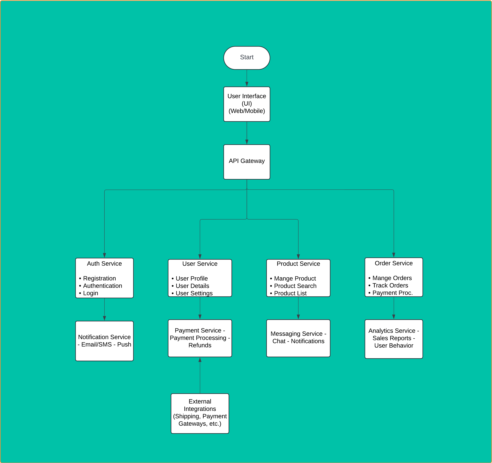

# Requirement Gathering and Analysis Document

## Project Overview

The proposed project is a web application inspired by eBay, designed to facilitate the buying and selling of new and used products within a specified price range. Sellers will be able to post products for sale and advertise them, while buyers can search for and view products, making purchases online. The application will feature direct communication between buyers and sellers without intermediaries. A secure payment system will handle transactions, withholding a platform fee from the final product price before releasing the remainder to the seller. Buyers can rate their purchasing experience, including the seller and delivery. Notifications for all processes will be sent via SMS and email.

## Project Objectives

1. Enable sellers to sell products online.
2. Allow buyers to purchase products online.
3. Facilitate customer-to-customer (C2C) transactions.
4. Implement a commission-based fee structure for transactions.
5. Establish a communication channel for buyer-seller interactions.

## System Design

### Functional Requirements

#### User Management

- User registration and login
- User profile management
- User verification with OTP/SMS
- Password recovery
- Account security (2FA)
- User roles: seller/buyer

#### Product Catalog

- Product creation, update, and deletion by sellers
- Product advertisement by sellers
- Online product purchase by buyers (card/online banking)
- Seller payout processing

#### Shopping Cart

- Add/remove items to/from cart
- Update item quantities
- Save cart for later
- Apply promo codes and discounts

#### Order Management

- Order tracking for customers
- Order history access
- Order cancellation and return
- Notifications via email/SMS

#### Checkout Process

- Multiple shipping options
- Multiple payment methods (credit/debit cards, PayPal, etc.)
- Secure payment gateway integration
- Order review and confirmation

#### Communication

- Email/message notifications
- Online chat for buyer-seller communication

#### Customer Support

- Live chat support
- FAQ section
- Contact form
- Return and refund policies

#### Analytics and Reporting

- Sales reports
- Customer behavior analysis
- Inventory reports
- Performance metrics

#### Mobile Responsiveness

- Mobile-friendly design
- Mobile app (optional)

### High Priority Features

- User registration and authentication
- Product catalog with search and filter functionality
- Shopping cart and checkout process
- Payment processing (credit/debit cards and PayPal)

### Medium Priority Features

- User profile management
- Advanced search and filtering options
- Wishlist feature
- Order tracking for customers

### Low Priority Features

- Advanced analytics and reporting
- Blog section for business/ecommerce tips and trends
- Customer reviews and ratings

### Non-Functional Requirements

- High availability in cloud with multiple regions (C2C portal)
- Scalability to accommodate horizontal growth
- Microservices architecture with loosely coupled services
- Logging and monitoring mechanisms for service health and availability
- Comprehensive documentation for system architecture and API usage

### Data Storage Requirements

- Consistency or eventual consistency
- Adherence to CAP theorem
- Distributed database system with high availability
- High availability of object storage across multiple regions

### Security Requirements

- Data encryption in transit and at rest
- Regular security audits and vulnerability assessments
- User data protection and privacy compliance (e.g., GDPR)

### Performance Requirements

- Fast response times and low latency
- Efficient transaction processing

### Compliance Requirements

- Adherence to relevant legal and regulatory requirements

### Usability Requirements

- Intuitive and user-friendly interface
- Easy navigation and accessibility

### Integration Requirements

- Integration with third-party services (e.g., shipping providers, additional payment gateways)

## Summary

This comprehensive overview ensures a clear roadmap for the development and successful implementation of the web application.
